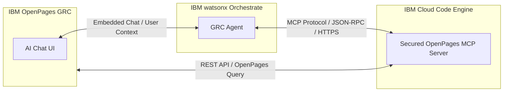
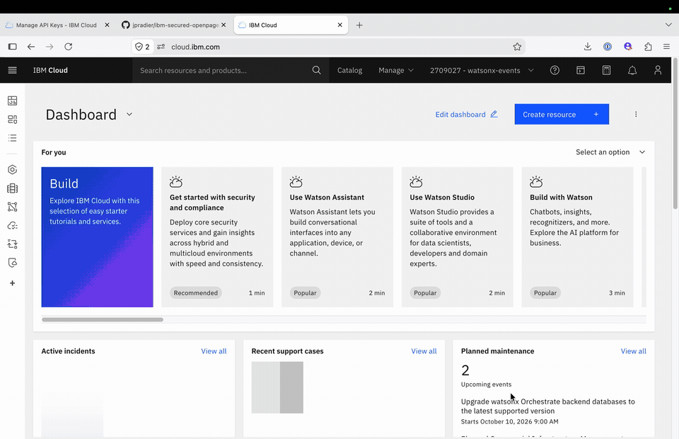
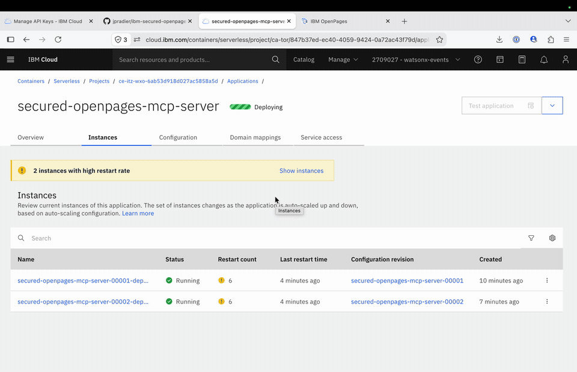
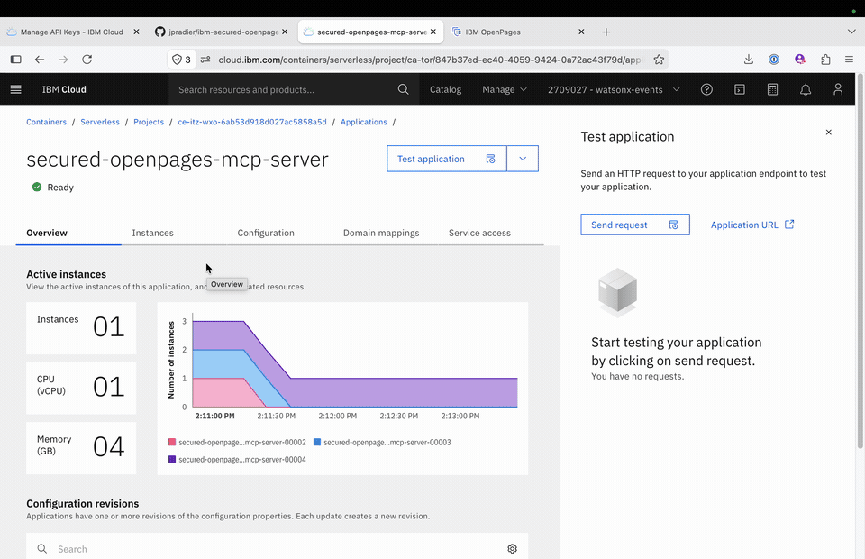

# IBM Secured OpenPages MCP Server

A Model Context Protocol (MCP) server that securely connects AI agents (such as IBM watsonx Orchestrate) to the IBM OpenPages GRC platform.

This guide provides a step-by-step walkthrough for deploying and integrating the AI Chat in IBM OpenPages with watsonx Orchestrate.



> 📖 **Technical Reference**: For in-depth architecture details, developer setup, MCP resources, query grammar, testing, and full configuration reference, see [README_TECHNICAL.md](README_TECHNICAL.md).

---

## Table of Contents

1. [Step 1: Deploy a Secured MCP Server on IBM Cloud Code Engine](#step-1-deploy-a-secured-mcp-server-on-ibm-cloud-code-engine)
   - [1.1 Build and Deploy from GitHub](#11-build-and-deploy-from-github)
   - [1.2 Configure Environment Variables](#12-configure-environment-variables)
   - [1.3 Debugging and Modifying Configuration](#13-debugging-and-modifying-configuration)
   - [1.4 Verify and Test the MCP Server](#14-verify-and-test-the-mcp-server)
2. [Step 2: Configure a GRC Agent on IBM watsonx Orchestrate](#step-2-configure-a-grc-agent-on-ibm-watsonx-orchestrate)
3. [Step 3: Configure AI Chat within OpenPages](#step-3-configure-ai-chat-within-openpages)

---

## Step 1: Deploy a Secured MCP Server on IBM Cloud Code Engine

In this step, you will deploy this MCP server on IBM Cloud Code Engine directly from this GitHub repository as a containerized application with secured endpoints.

### 1.1 Build and Deploy from GitHub

1. Log in to your **IBM Cloud** account and navigate to **Code Engine** > **Applications**.
2. Select your Code Engine project (or create a new one).
3. Click **Create application**.
4. Choose **Source code** as the source type and enter this GitHub repository URL.
5. Specify the build configuration:
   - **Branch name**: Set to `develop`.
   - **Build strategy**: Dockerfile (the repository root contains a production-ready `Dockerfile`).
   - Specify the target container registry (e.g., IBM Cloud Container Registry) where the built container image will be stored.
6. Configure the runtime settings (CPU, memory, port `8080`, and scaling options).

> ⚠️ **Important**: Do not click **Create** just yet! Make sure you configure the environment variables in section 1.2 first before submitting the creation form.



### 1.2 Configure Environment Variables

Under the **Environment variables** section of the Code Engine application configuration, define the required variables based on your `.env` configuration:

- **`OPENPAGES_BASE_URL`**: The base URL of your target OpenPages instance (e.g., `https://<instance-domain>`).
- **`OPENPAGES_API_ROOT`**: The REST API root path prepended to all `/api/v2/...` calls. Common values: `/opgrc` (standard SaaS/on-prem, the default) or `/openpages/`. Trailing slashes are stripped automatically. Use `none` or `off` if your instance serves the API directly at `/api/v2/...` (Code Engine cannot store empty strings).
- **`OPENPAGES_AUTHENTICATION_TYPE`**: Authentication scheme used to connect to OpenPages (`basic`, `bearer`, `ibm_cloud`, `mcsp`, or `cp4d`).
- **`OPENPAGES_USERNAME` / `OPENPAGES_PASSWORD`**: Default instance credentials when using `basic` authentication.
- **`MCP_API_TOKEN`**: **(Critical Security Setting)** The token required to authenticate incoming requests to this MCP server.
  > 🔒 **Focus on `MCP_API_TOKEN`**: When using basic authorization against the MCP server, this variable must contain the **Base64-encoded** string of `username:password` (for example, base64 of `admin:secretpassphrase`). Any client connecting to the MCP endpoints must provide this token (e.g., in the `Authorization: Bearer <MCP_API_TOKEN>` header or `Authorization: Basic <base64>` header) to gain access.
  >
  > You can generate this Base64 string from your shell using:
  > ```bash
  > echo -n "username:password" | base64
  > ```

### 1.3 Debugging and Modifying Configuration

If the application fails to deploy or the container crashes on startup:

1. Check the **Application logs** and **Revisions** tab in the Code Engine console to view real-time error messages and stack traces.
2. Correct configuration errors (such as incorrect environment variable names, missing credentials, or incorrect base URL formatting) by **creating a new revision** or editing the application configuration.
3. Once a new revision is healthy and running, you can safely delete older, failed revisions to keep your environment clean.



### 1.4 Verify and Test the MCP Server

Once the Code Engine application status is **Ready**:

1. Copy the public application URL generated by Code Engine.
2. Open your browser or API testing tool and access the `/mcp` endpoint (e.g., `https://<your-app-domain>.codeengine.appdomain.cloud/mcp`).
3. Authenticate using your configured credentials / `MCP_API_TOKEN` when prompted.
4. Verify that the MCP server responds correctly and the endpoint is accessible.



This completes the deployment of your secured OpenPages MCP server on IBM Cloud Code Engine.

---

## Step 2: Configure a GRC Agent on IBM watsonx Orchestrate

> ⏳ *Coming soon* — This section will guide you through connecting watsonx Orchestrate to the Code Engine MCP server endpoint, registering the OpenPages tools, and setting up the agent system prompt.

---

## Step 3: Configure AI Chat within OpenPages

> ⏳ *Coming soon* — This section will cover embedding the Orchestrate GRC agent into the OpenPages AI Chat interface, configuring end-user security tickets, and validating user context.
