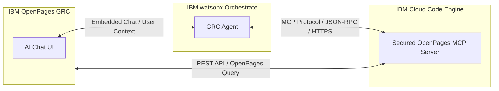
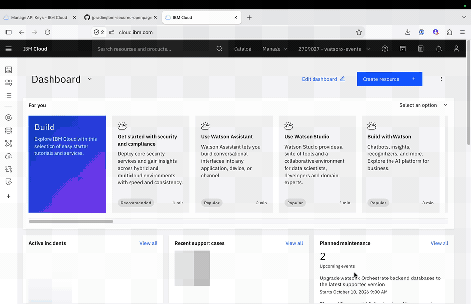
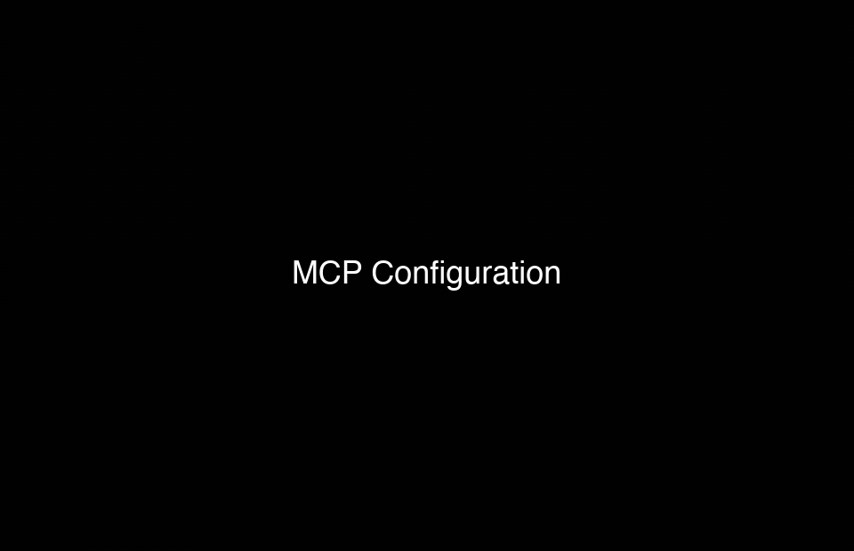
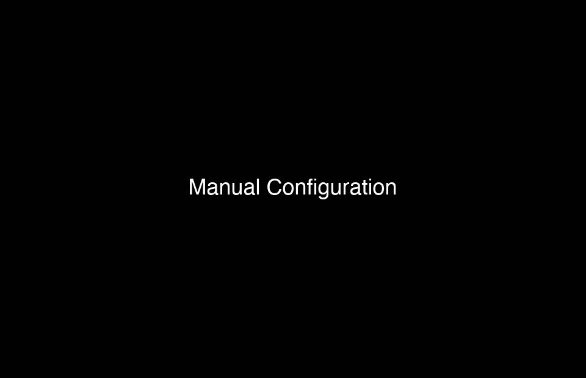
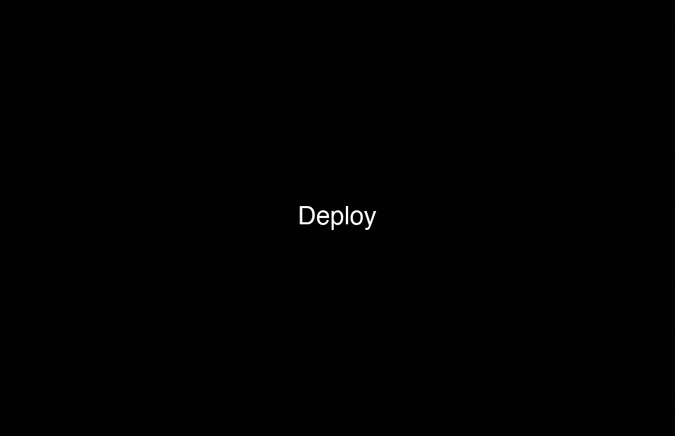
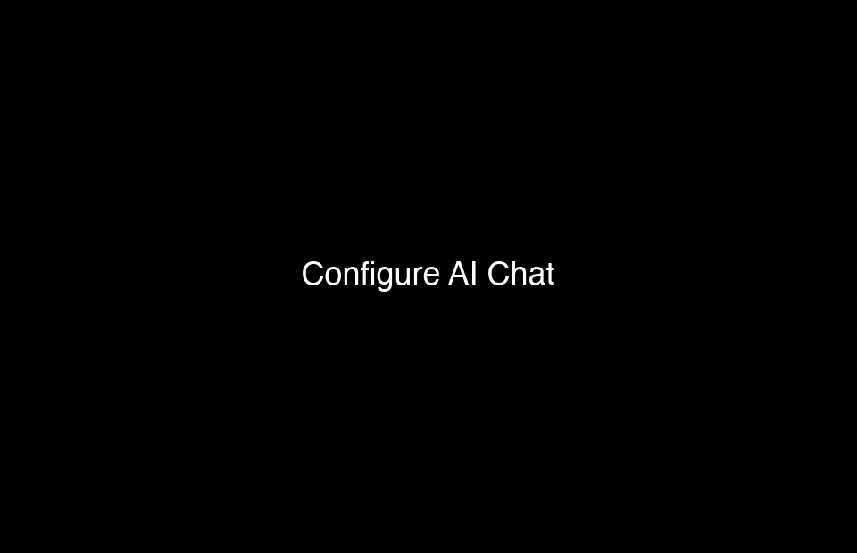

# IBM Secured OpenPages MCP Server

A Model Context Protocol (MCP) server that securely connects AI agents (such as IBM watsonx Orchestrate) to the IBM OpenPages GRC platform.

This guide provides a step-by-step walkthrough for deploying and integrating the AI Chat in IBM OpenPages with watsonx Orchestrate.



> 📖 **Technical Reference**: For in-depth architecture details, developer setup, MCP resources, query grammar, testing, and full configuration reference, see [README.md](README.md).

---

## Table of Contents

1. [Step 1: Deploy a Secured MCP Server on IBM Cloud Code Engine](#step-1-deploy-a-secured-mcp-server-on-ibm-cloud-code-engine)
   - [1.1 Build and Deploy from GitHub](#11-build-and-deploy-from-github)
   - [1.2 Configure Environment Variables](#12-configure-environment-variables)
   - [1.3 Debugging and Modifying Configuration](#13-debugging-and-modifying-configuration)
   - [1.4 Verify and Test the MCP Server](#14-verify-and-test-the-mcp-server)
2. [Step 2: Configure a GRC Agent on IBM watsonx Orchestrate](#step-2-configure-a-grc-agent-on-ibm-watsonx-orchestrate)
   - [2.1 Register the MCP Server in Orchestrate](#21-register-the-mcp-server-in-orchestrate)
   - [2.2 Create the GRC Agent with Bob](#22-create-the-grc-agent-with-bob)
   - [2.3 Refine the Agent with Bob and Starter Prompts](#23-refine-the-agent-with-bob-and-starter-prompts)
   - [2.4 Alternative: Create or Edit the Agent Directly in Orchestrate](#24-alternative-create-or-edit-the-agent-directly-in-orchestrate)
   - [2.5 Deploy the Agent to Production](#25-deploy-the-agent-to-production)
   - [2.6 Verify the Live Agent](#26-verify-the-live-agent)
3. [Step 3: Configure AI Chat within OpenPages](#step-3-configure-ai-chat-within-openpages)
   - [3.1 Copy Agent Information from Orchestrate](#31-copy-agent-information-from-orchestrate)
   - [3.2 Configure AI Chat in OpenPages](#32-configure-ai-chat-in-openpages)
   - [3.3 Verify and Test Your Agent](#33-verify-and-test-your-agent)

---

## Step 1: Deploy a Secured MCP Server on IBM Cloud Code Engine

In this step, you will deploy this MCP server on IBM Cloud Code Engine directly from this GitHub repository as a containerized application with secured endpoints.

### 1.1 Build and Deploy from GitHub

1. Log in to your **IBM Cloud** account and navigate to **Code Engine** > **Applications**.
2. Select your Code Engine project (or create a new one).
3. Click **Create application**.
4. Choose **Source code** as the source type and enter this GitHub repository URL.
5. Specify the build configuration:
   - **Branch name**: Set to `develop`.
   - **Build strategy**: Dockerfile (the repository root contains a production-ready `Dockerfile`).
   - Specify the target container registry (e.g., IBM Cloud Container Registry) where the built container image will be stored.
6. Configure the runtime settings (CPU, memory, port `8080`, and scaling options).

> ⚠️ **Important**: Do not click **Create** just yet! Make sure you configure the environment variables in section 1.2 first before submitting the creation form.



### 1.2 Configure Environment Variables

Under the **Environment variables** section of the Code Engine application configuration, define the required variables based on your `.env` configuration:

- **`OPENPAGES_BASE_URL`**: The base URL of your target OpenPages instance (e.g., `https://<instance-domain>`).
- **`OPENPAGES_API_ROOT`**: The REST API root path prepended to all `/api/v2/...` calls. Common values: `/opgrc` (standard SaaS/on-prem, the default) or `/openpages/`. Trailing slashes are stripped automatically. Use `none` or `off` if your instance serves the API directly at `/api/v2/...` (Code Engine cannot store empty strings).
- **`OPENPAGES_AUTHENTICATION_TYPE`**: Authentication scheme used to connect to OpenPages (`basic`, `bearer`, `ibm_cloud`, `mcsp`, or `cp4d`).
- **`OPENPAGES_USERNAME` / `OPENPAGES_PASSWORD`**: Default instance credentials when using `basic` authentication.
- **`MCP_API_TOKEN`**: **(Critical Security Setting)** The token required to authenticate incoming requests to this MCP server.
  > 🔒 **Focus on `MCP_API_TOKEN`**: When using basic authorization against the MCP server, this variable must contain the **Base64-encoded** string of `username:password` (for example, base64 of `admin:secretpassphrase`). Any client connecting to the MCP endpoints must provide this token (e.g., in the `Authorization: Bearer <MCP_API_TOKEN>` header or `Authorization: Basic <base64>` header) to gain access.
  >
  > You can generate this Base64 string from your shell using:
  > ```bash
  > echo -n "username:password" | base64
  > ```

### 1.3 Debugging and Modifying Configuration

If the application fails to deploy or the container crashes on startup:

1. Check the **Application logs** and **Revisions** tab in the Code Engine console to view real-time error messages and stack traces.
2. Correct configuration errors (such as incorrect environment variable names, missing credentials, or incorrect base URL formatting) by **creating a new revision** or editing the application configuration.
3. Once a new revision is healthy and running, you can safely delete older, failed revisions to keep your environment clean.


### 1.4 Verify and Test the MCP Server

Once the Code Engine application status is **Ready**:

1. Copy the public application URL generated by Code Engine.
2. Open your browser or API testing tool and access the `/mcp` endpoint (e.g., `https://<your-app-domain>.codeengine.appdomain.cloud/mcp`).
3. Authenticate using your configured credentials / `MCP_API_TOKEN` when prompted.
4. Verify that the MCP server responds correctly and the endpoint is accessible.


This completes the deployment of your secured OpenPages MCP server on IBM Cloud Code Engine.

---

## Step 2: Configure a GRC Agent on IBM watsonx Orchestrate

Now that your secured MCP server is running on Code Engine, you need to create a **GRC Agent** in IBM watsonx Orchestrate. This agent will leverage the OpenPages tools exposed by the MCP server to answer your GRC users' requests — searching for risks, controls, issues, and other governance objects — all through natural language.

### 2.1 Register the MCP Server in Orchestrate

To connect securely to the MCP server running on Code Engine, you first need to register it as a **remote MCP Server** in Orchestrate. This is a two-step process inside Orchestrate:

1. Navigate to **Tools & Integrations** in your Orchestrate instance.
2. Create a new **Connection** pointing to your Code Engine application URL, and supply the username and password corresponding to the `MCP_API_TOKEN` (Base64-encoded) you configured in Step 1 as the authorization credential.
3. Once the connection is saved, create a new **MCP Server** definition that references that connection and points to the `/mcp` endpoint of your Code Engine application.
4. Orchestrate will discover and register all the OpenPages tools exposed by the MCP server automatically.



### 2.2 Create the GRC Agent with Bob

The quickest way to create your GRC agent is to use **Bob** — the AI assistant built into Orchestrate — via the **Create with Bob** option. A ready-to-use sample agent definition is included in this repository under [`samples/`](../samples/):

1. Open one of the sample YAML files (e.g., [`watsonx_orchastrate_sample_ontology_based_agent.yaml`](../samples/watsonx_orchastrate_sample_ontology_based_agent.yaml)) and copy its full content.
2. In Orchestrate, start a new agent and choose **Create with Bob**.
3. Paste the YAML into Bob's input. You can ask Bob to:
   - Rename the agent to match your use case.
   - Remove any tools that **modify** objects on your OpenPages instance (e.g., create, update, delete operations) to keep the agent read-only and safe for initial rollout.
4. Once satisfied, click **Import** to create the agent.

> 🔑 **API Key**: When prompted, paste the **API key of your Orchestrate instance** so that Bob can securely connect to it and apply your changes.


### 2.3 Refine the Agent with Bob and Starter Prompts

After the initial creation, you can continue to iterate on your agent using Bob — no need to edit YAML manually. If you followed the setup in this guide, the **Orchestrate skills** should already be installed in Bob, giving you full access to agent management operations.

1. Ask Bob to add **starter prompts** to your agent — these are example questions displayed to end users that give them an idea of what they can ask the GRC agent (e.g., *"List the top 10 open risks in my portfolio"*, *"Show me all controls linked to SOX compliance"*).
2. Review the suggested prompts with Bob and adjust them until they match your users' typical workflows.
3. Once you are happy with the changes, ask Bob to **re-import** (or re-apply) the updated agent definition.
4. Switch back to the Orchestrate UI and refresh the page — your changes will appear automatically.


### 2.4 Alternative: Create or Edit the Agent Directly in Orchestrate

If you prefer not to use Bob, you can create and configure the agent entirely through the **Orchestrate UI**. However, keep in mind that you will miss two key benefits that Bob provides:

1. **Natural language configuration** — with Bob, you describe changes in plain English instead of editing YAML or navigating forms, which requires less product expertise.
2. **Version control integration** — Bob can synchronize your agent definitions with a **GitHub or GitLab** repository, giving you proper versioning, pull request reviews, and change history for your agents.

If those trade-offs are acceptable for your situation, the Orchestrate UI remains a fully capable fallback for all agent configuration tasks.



### 2.5 Deploy the Agent to Production

Once you are happy with your agent, it is time to promote it to **Live** (production).

1. In a realistic production scenario, you would first build an **evaluation set** to benchmark each release and manage the agent life cycle with confidence. Consider doing this before your first real release.
2. For this guide, proceed directly to deployment: click **Deploy**, create the **first version** of your agent, and confirm the deployment — the process is straightforward and takes only a moment.



### 2.6 Verify the Live Agent

Before moving on, do a quick sanity check to confirm that your agent is live and responding correctly.

1. Open the **Live** environment in Orchestrate and locate your newly deployed GRC agent.
2. Send a sample GRC question (e.g., *"List the open risks assigned to me"*) and verify that the agent calls the correct OpenPages tools and returns a meaningful answer.
3. Once confirmed, you are ready to move to **Step 3**, where you will surface this agent inside the OpenPages UI.


---

## Step 3: Configure AI Chat within OpenPages

This step is all about **embedding your Orchestrate GRC Agent into the AI Chat interface within OpenPages**. The integration uses a public/private key pair to ensure that all communication between OpenPages and Orchestrate is safely encrypted end-to-end — no data travels in the clear between the two platforms.

### 3.1 Copy Agent Information from Orchestrate

Before configuring OpenPages, you need to generate an encryption key pair and copy the agent embed snippet from Orchestrate.

1. **Generate a valid RSA private/public key pair** by following the official IBM documentation:
   [Configuring security for embedded chat](https://www.ibm.com/docs/en/watsonx/watson-orchestrate/base?topic=chat-configuring-security-embedded)

2. **Register the public key in Orchestrate**: navigate to the **Embed Security** tab on the **Settings** page of your Orchestrate instance and paste the public key there.

3. **Retrieve the embed snippet**: go back to your GRC agent, open the **Deploy** section, select the **Live** tab, and copy the **Embedded Agent snippet** to your clipboard — you will need it in the next subsection.


### 3.2 Configure AI Chat in OpenPages

1. Log in to your **OpenPages** instance as an administrator.
2. Navigate to **Settings** > **Integration** > **AI Chat**.
3. **Paste the Embedded Agent snippet** copied from Orchestrate into the configuration field.
4. **Select the user profile(s)** that should have access to the AI Chat — select your own profile at minimum, and add any other profiles you want to grant access to.
5. **Paste the private key** (the counterpart of the public key you registered in Orchestrate) into the private key field to complete the secure channel setup.



### 3.3 Verify and Test Your Agent

1. Allow a **couple of minutes** for Orchestrate to be ready to accept new encrypted requests after the key pair has been registered.
2. **Refresh your OpenPages instance** and open the **AI Chat** panel.
3. Your GRC Agent should now be live and ready to answer questions directly inside OpenPages!


You are now ready to build on this foundation — iterate on your agent's instructions, refine its tools, and add starter prompts to continuously improve the experience for your GRC users.
